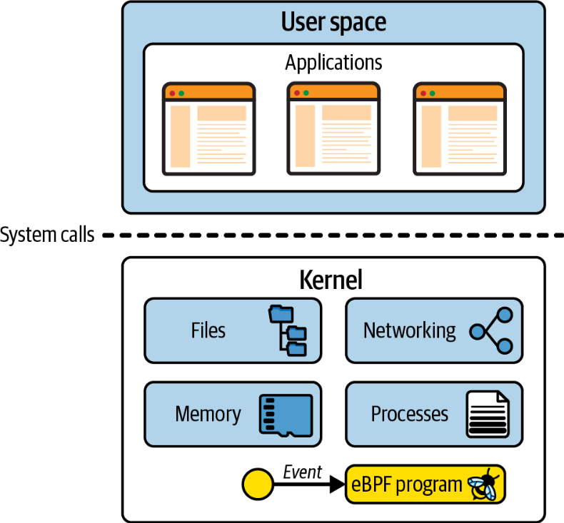

# Chapter 1 - What is eBPF, and Why Is It Important?

- eBPF: Extended Berkeley Packet Filter.

- Definition:
    - eBPF is a revolutioanry kernel technologies that allows developers to write custom code that can be loaded into the kernel dynamically, changing the kernel behaves. This enables a new generation of highly performant networking, observability, and security tools. 
        - Performance tracing of pretty much any aspect of a system.
	- High-performance networking, with built-in visibility.
	- Detecting and (optionally) preventing malicious activity.

## eBPF's Roots: The Berkeley Packet Filter

- has its roots in the BSD Packet Filter, described in 1993, paper written by Lawrence Berkeley National Laboratory's Steven McCanne and Van Jacobson.
    - paper discuss pseudomachine that can run *filters*, which are programs to determine wheter to accept or reject a network packet.
    - programs were whitten in BPF instruction set, a general-purpose of 32-bit instructions that closely resembles assembly language.

Ex.

```assembly
ldh	[12]
jeq	#ETHERTYPE IP, L1, L2
L1:	ret	#TRUE
L2:	ret	#0
```

- This code filters out packets that are not Internet Protocol (IP) packets.
    - **ldh**= loads a 2-byte value starting at byte 12 in this packet.
    - **jeq**= compare the value that represents a IP packet
    - if last instruction is true, then jump to instruction labeled L1, where packet is accepted returning a non-zero value, else return 0

- BPF ("Berkeley Packet Filter"), introduced to Linux in 1997, in kernel version 2.1.75, where it was used in the tcpdump utility as an efficient way to capture the packets to be traced out.

- in 2012, when seccomp-bpf was introduced in version 3.5 of the kernel. This enabled the use of BPF programs to make decisions about wheter to allow or deny user space applications from making system calls. This was the first step in the evolving BPF from the narrow scope of packet filtering to the general-purpose platform it is today.

## From BPF to eBPF

- BPF evolved to waht we call "extended BPF" or "eBPF" starting in kernel version 3.18 in 2014. This involved several significant changes:
    - BPF instructions overhauled to be more efficient on 64-bit machines, and the interpreter was entirely rewritten.
    - eBPF *maps* were introduced: data structures that can be accessed by BPF programs and by user space applications, allowing information to be shared between them.
    - the bpf() syscall was added, so that user space programs can interact with eBPF programs in the kernel.
    - several BPF helpres functions were added.
    - the eBPF verifier was added to ensure that eBPF programs are safe to run.

## The Evolution of eBPF to Production Systems

- *kprobes* (kernel probes) had existed in linux kernel since 2005, allowing for traps to be set on almost any instruction in the kernel code. Developers could write kernel modules that attached functions to kprobes for debugging or performance measurement purposes.

- eBPF integration with kprobes was added in 2015.

- by 2016, first time using eBPF in production systems. Bredan Gregg's work tracing at Netflix became widely known in infrastructure and operations circles.

- in the same year, Cilium project was announced, being the first networking project to use eBPF to replace the entire datapath in container environments.

- in 2017, Facebook developed Katran, a layer 4 load balancer, met Facebook's need for a highly scalable and fast solution. Every single packet to Facebook.com since 2017 has passed through eBPF/XDP.

- In 2018, eBPF became a separate subsystem within the Linux Kernel, with Daniel Borkmann from Isovalent and Alecei Starovoitov from Meta as its maintainers. 

- In 2018, BTF (BPF Type Format) which makes eBPF programs much more portable

- 2020, LSM BPF, allowing eBPF programs to be attached to the Linux Security Module (LSM) kernel interface. This indicated that a third major use case for eBPF: it became clear that eBPF is a great platform for security tooling, in addition to networking and observability.


## The Linux Kernel

- kernel vs user space

- *linux kernel* is the software layer between your application and the hardware they're running on. Applications run in an unprivileged layer called *user space*, which can't access the hardware directly. Instead, an application uses syscalls interface to request the kernel to act on its behalf.





